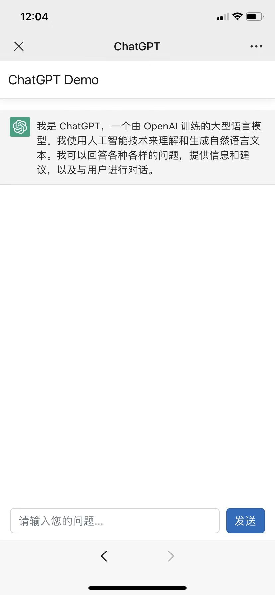

一个使用 ChatGPT 官方 API 的简单 Web SPA

* 使用的模型为 gpt-3.5-turbo
* 后端使用 asp.net core 7.0
* 前端使用 Angular 15.x + Bootstrap
* 因为gpt3.5 api的token数有限制,并且按token收费,所以没支持历史消息

启动流程

1. 安装依赖: dotnet-sdk-7.x, node
2. 在 appsettings.json 中填入 ApiKey
3. 在ChatGPT目录执行 ```dotnet run```

